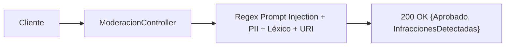

# Diagrama — 47-endpoint-moderacion

```mermaid
flowchart LR
  Cliente --> ModeracionController
  ModeracionController --> RegexGuard["Regex Prompt Injection + PII + Léxico + URI"]
  RegexGuard --> OK["200 OK {Aprobado, InfraccionesDetectadas}"]
```
