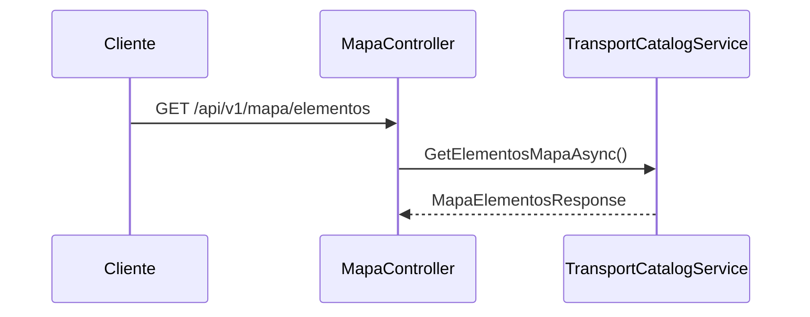

# Diagrama — 48-endpoint-mapa-elementos

```mermaid
sequenceDiagram
  Cliente->>MapaController: GET /api/v1/mapa/elementos
  MapaController->>TransportCatalogService: GetElementosMapaAsync()
  TransportCatalogService-->>MapaController: MapaElementosResponse
```
