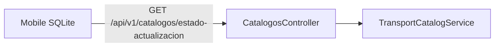

# Diagrama — 49-endpoint-catalogos-estado

```mermaid
flowchart LR
  M["Mobile SQLite"] -->|GET /api/v1/catalogos/estado-actualizacion| C["CatalogosController"]
  C --> T["TransportCatalogService"]
```
