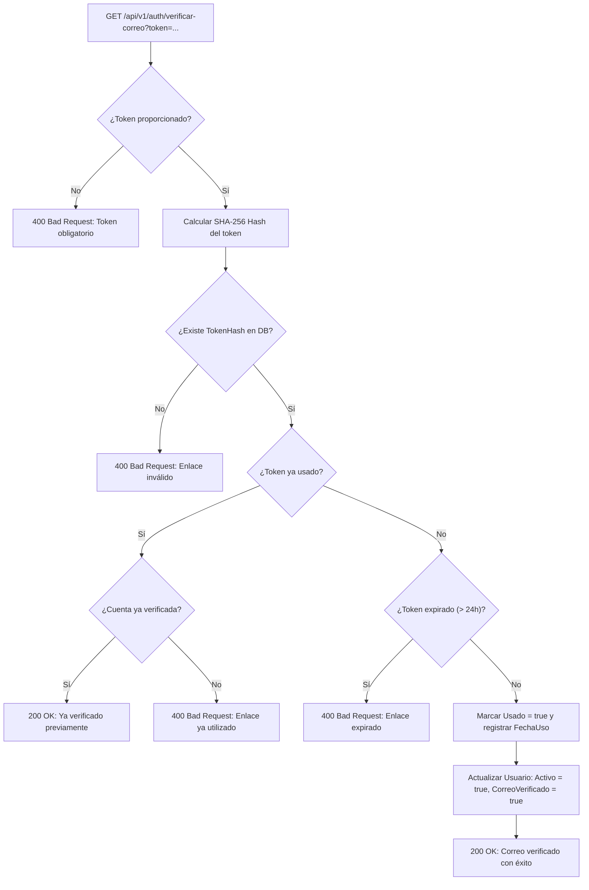

# Diagramas — 56-endpoint-auth-verificar-correo

> Spec: `spec.md` · Plan: `plan.md`.

## 1. Flujo de Verificación

```mermaid
flowchart TD
    A["GET /api/v1/auth/verificar-correo?token=..."] --> B{"¿Token proporcionado?"}
    B -- No --> C["400 Bad Request: Token obligatorio"]
    B -- Sí --> D["Calcular SHA-256 Hash del token"]
    D --> E{"¿Existe TokenHash en DB?"}
    E -- No --> F["400 Bad Request: Enlace inválido"]
    E -- Sí --> G{"¿Token ya usado?"}
    G -- Sí --> H{"¿Cuenta ya verificada?"}
    H -- Sí --> I["200 OK: Ya verificado previamente"]
    H -- No --> J["400 Bad Request: Enlace ya utilizado"]
    G -- No --> K{"¿Token expirado (> 24h)?"}
    K -- Sí --> L["400 Bad Request: Enlace expirado"]
    K -- No --> M["Marcar Usado = true y registrar FechaUso"]
    M --> N["Actualizar Usuario: Activo = true, CorreoVerificado = true"]
    N --> O["200 OK: Correo verificado con éxito"]
```
