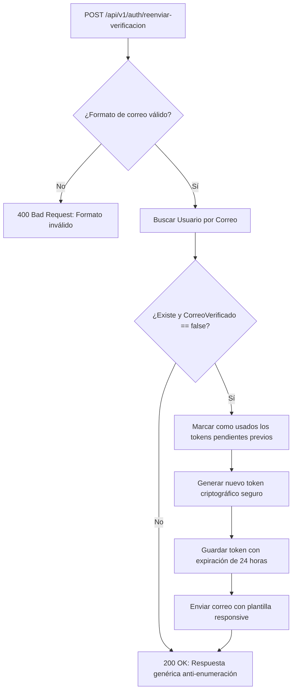

# Diagramas — 57-endpoint-auth-reenviar-verificacion

> Spec: `spec.md` · Plan: `plan.md`.

## 1. Flujo de Reenvío

```mermaid
flowchart TD
    A["POST /api/v1/auth/reenviar-verificacion"] --> B{"¿Formato de correo válido?"}
    B -- No --> C["400 Bad Request: Formato inválido"]
    B -- Sí --> D["Buscar Usuario por Correo"]
    D --> E{"¿Existe y CorreoVerificado == false?"}
    E -- No --> F["200 OK: Respuesta genérica anti-enumeración"]
    E -- Sí --> G["Marcar como usados los tokens pendientes previos"]
    G --> H["Generar nuevo token criptográfico seguro"]
    H --> I["Guardar token con expiración de 24 horas"]
    I --> J["Enviar correo con plantilla responsive"]
    J --> F
```
